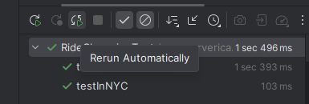
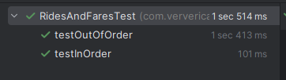

# Лабораторная №3

### HourlyTipsTest

**[HourlyTipsExercise.java](src/main/java/com/ververica/flinktraining/exercises/datastream_java/windows/HourlyTipsExercise.java)**

### ExpiringStateTest

**[ExpiringStateExercise.java](src/main/java/com/ververica/flinktraining/exercises/datastream_java/process/ExpiringStateExercise.java)**

### RideCleanisingTest

**[RideCleansingExercise.java](src/main/java/com/ververica/flinktraining/exercises/datastream_java/basics/RideCleansingExercise.java)**

### RidesAndFaresTest

**[RidesAndFaresExercise.java](src/main/java/com/ververica/flinktraining/exercises/datastream_java/state/RidesAndFaresExercise.java)**